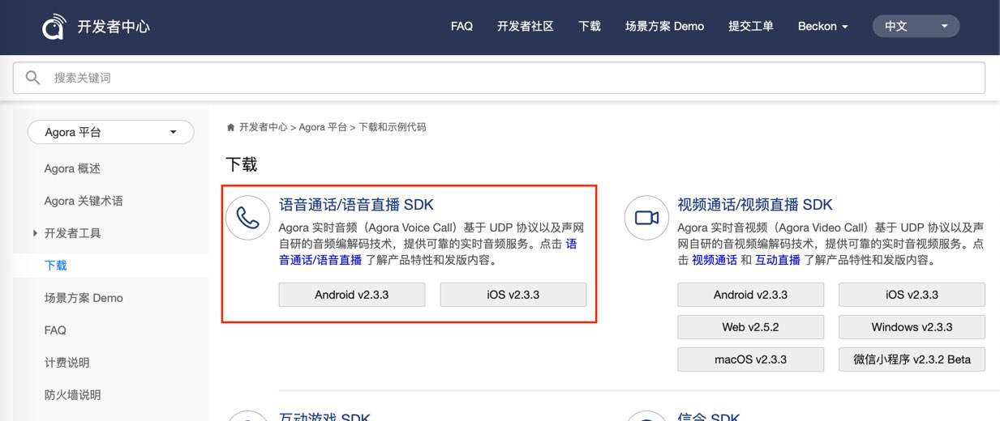

# 在线语音聊天室

*Read this in other languages: [English](README.md)*

## 场景描述

**语音聊天室** 是一种纯音频的使用场景。用户作为主播或者听众加入房间进行语音聊天，也可以在房间内任意切换自己的主播/听众身份。

这个示例程序展示了对音频设置有不同的需求的四种常见语音聊天室类型：

- **开黑聊天室**: 频道内用户需要频繁上下麦，用户不想花费过多流量
- **娱乐房间**: 频道内用户需要频繁上下麦，用户对流量使用不敏感，对音质有要求
- **K 歌房**: 满足唱歌场景需求，还原KTV效果
- **FM 超高音质房间**: 超高音质，声音还原度高，语音电台主播首选

## 体验 Demo

你可直接下载安装 [Android apk 安装包](https://github.com/AgoraIO-Usecase/Chatroom/releases/download/2.3.3/Fenbei_for_Android_v2.3.3.18.apk.zip) 或者 [iOS Appstore](https://itunes.apple.com/cn/app//id1417827292?mt=8) 进行体验。

成功运行 Demo 后，在界面上创建房间，输入频道名称，并选择一种房间类型。使用另一台设备进入房间，即为观众观看。观众可以申请上麦从而实现和房主的实时互动。

*本开源示例项目简化了业务相关的逻辑，在体验 Demo 中出现的申请上麦、抱麦等业务逻辑并不包含在开源示例项目中*

## 运行示例程序

1. 在 [Agora.io 用户注册页](https://dashboard.agora.io/cn/signup/) 注册账号，并创建自己的测试项目，获取到 AppID。


2. 下载 Agora [语音通话／语音直播 SDK](https://docs.agora.io/cn/Agora%20Platform/downloads)。


#### Android
1. 将有效的 AppID 填写进 "Android/app/src/main/res/values/strings_config.xml"

  ```
  <string name="private_app_id"><#YOUR APP ID#></string>
  ```

2. 解压 SDK 压缩包，将其中的 **libs** 文件夹下的 ***.jar** 复制到本项目的 **app/libs** 下，其中的 **libs** 文件夹下的 **arm64-v8a**/**x86**/**armeabi-v7a** 复制到本项目的 **app/src/main/jniLibs** 下。

3. 使用 Android Studio 打开该项目，连接 Android 测试设备，编译并运行。

   运行环境:
    * Android Studio 3.1 +
    * Android SDK API Level >= 16
    * Android 4.1 或以上支持语音和视频功能的真机设备

#### iOS
1. 将有效的 AppID 填写进 KeyCenter.swift

	```
	static func appId() -> String {
	    return <#YOUR APPID#>
	}
	```

2. 解压 SDK 压缩包，将文件 **AgoraAudioKit.framework** 复制到本项目的 iOS/ChatRoom 文件夹下。

3. 使用 XCode 打开 iOS/AgoraChatRoom.xcodeproj，连接 iOS 测试设备，设置有效的开发者签名后即可运行。

		运行环境:
		​* XCode 10.0 +
		​* iOS 8.0 +

## API 列表

Agora SDK 关键 API 列表：

iOS|Android
---|---
[sharedEngineWithAppId:delegate:](https://docs.agora.io/cn/Interactive%20Broadcast/API%20Reference/oc/Classes/AgoraRtcEngineKit.html#//api/name/sharedEngineWithAppId:delegate:)|[create](https://docs.agora.io/cn/Interactive%20Broadcast/API%20Reference/java/classio_1_1agora_1_1rtc_1_1_rtc_engine.html#a35466f690d0a9332f24ea8280021d5ed)
[setChannelProfile](https://docs.agora.io/cn/Interactive%20Broadcast/API%20Reference/oc/Classes/AgoraRtcEngineKit.html#//api/name/setChannelProfile:)|[setChannelProfile](https://docs.agora.io/cn/Interactive%20Broadcast/API%20Reference/java/classio_1_1agora_1_1rtc_1_1_rtc_engine.html#a1bfb76eb4365b8b97648c3d1b69f2bd6)
[setClientRole](https://docs.agora.io/cn/Interactive%20Broadcast/API%20Reference/oc/Classes/AgoraRtcEngineKit.html#//api/name/setClientRole:)|[setClientRole](https://docs.agora.io/cn/Interactive%20Broadcast/API%20Reference/java/classio_1_1agora_1_1rtc_1_1_rtc_engine.html#aa2affa28a23d44d18b6889fba03f47ec)
[setAudioProfile](https://docs.agora.io/cn/Interactive%20Broadcast/API%20Reference/oc/Classes/AgoraRtcEngineKit.html#//api/name/setAudioProfile:scenario:)|[setAudioProfile](https://docs.agora.io/cn/Interactive%20Broadcast/API%20Reference/java/classio_1_1agora_1_1rtc_1_1_rtc_engine.html#a34175b5e04c88d9dc6608b1f38c0275d)
[joinChannel](https://docs.agora.io/cn/Interactive%20Broadcast/API%20Reference/oc/Classes/AgoraRtcEngineKit.html#//api/name/joinChannelByToken:channelId:info:uid:joinSuccess:)|[joinChannel](https://docs.agora.io/cn/Interactive%20Broadcast/API%20Reference/java/classio_1_1agora_1_1rtc_1_1_rtc_engine.html#a8b308c9102c08cb8dafb4672af1a3b4c)

## 功能列表
这个示例程序演示了如何使用 声网 Agora 的音频SDK，实现不同类型语音聊天室的音频聊天功能。

- 加入房间：选择一个房间类型，使用主播或听众的身份加入房间，和房间内的其他用户进行语音交流；
- 主播/听众切换：在房间内可以随时使用“上麦”按钮来切换自己的主播/听众身份；
- 听筒/外放切换：可以使用“外放”按钮切换听筒或外放；
- 停止发送音频：主播可以使用“静音自己”按钮停止发送音频；
- 停止接收音频：可以使用“不收音频”按钮停止接收房间内其他人的音频；
- 音乐伴奏：主播可以使用“伴奏”按钮播放伴奏音乐并发送给房间内其他人；
- 变声效果：主播可以使用“变声”按钮选择自己的变声效果。

## 常见问题
1. 当 audioProfile 的 scenario 被设为 Default，ShowRoom，Education，GameStreaming 且为单主播时不开启降噪如果在这种情况下，觉得噪声过大，可以通过私有接口`agoraKit.setParameters("{\"che.audio.enable.ns\":true}")`来开启降噪
   
2. 当调用 disableAudio 或 leaveChannel 时，如果有其他应用在使用 AVAudioSession 时（进行录放音）会被打断。可以通过调用`agoraKit.setAudioSessionOperationRestriction(.deactivateSession)`来使 audio session 在 disableAudio 或 leaveChannel 后依然保持活跃状态。

## 联系我们

- 如果发现了示例程序的 bug，欢迎提交 [issue](https://github.com/AgoraIO-Usecase/Chatroom/issues)
- 声网 SDK 完整 API 文档见 [文档中心](https://docs.agora.io/cn/)
- 如果在集成中遇到问题，你可以到 [开发者社区](https://dev.agora.io/cn/) 提问
- 如果有售前咨询问题，可以拨打 400 632 6626，或加入官方Q群 12742516 提问
- 如果需要售后技术支持，你可以在 [Agora Dashboard](https://dashboard.agora.io) 提交工单

## 代码许可

The MIT License (MIT).
