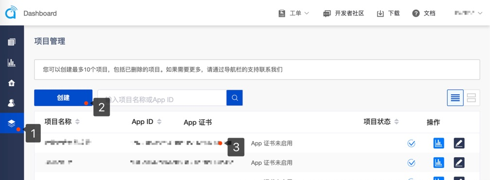

# 在线语音聊天室

*Read this in other languages: [English](README.md)*

## 场景描述

**语音聊天室** 一个典型的语聊房里，有一个房主，N 个观众。房间里所有观众都能听到房主的声音，也可以自由上麦、下麦。房主可以邀请观众上麦，或进行下麦、禁麦、解麦、封麦、解封等操作。同时，所有用户都能看到麦位的实时变动。该场景在语音社交行业内应用广泛，尤其适用于在线 KTV、语音电台等场景。

该场景中：
- 有且仅有一个房主。
- 可以有多个观众。
- 观众成功上麦后，成为连麦主播。其余观众则还是普通观众。
- Agora 目前仅支持最多一个房主+十六个连麦主播实时互动。

## 功能列表
Agora 可以在你的项目中根据场景需要，实现如下功能。

- 实时音频：超低延时下，观众实时接收房主的音频流，保证语聊房的社交氛围；
- 互动连麦：房主邀请或观众请求上麦，连麦后，频道所有用户都能听到房主和连麦主播的声音；
- 麦位控制：房主对观众进行上麦、下麦、禁麦、解麦、封麦、解封等操作，观众可以实时看到每个麦位及各麦位上观众的状态；
- 实时消息：房间内的主播和观众使用文字消息实时交流；观众还可以通过实时消息给主播送礼物，增加互动气氛；
- 用户管理：维护房间成员列表、用户昵称等；
- 混音：房主在说话的同时播放背景音乐，语聊房内所有观众都能听到，可以烘托主题氛围；
- 变声：通过变声，主播和连麦观众可以让自己的声音更有特色、符合人设、增加互动趣味。

## 运行示例程序

1. 在 [Agora.io 用户注册页](https://dashboard.agora.io/cn/signup/) 注册账号，并创建自己的测试项目，获取到 AppID。

   
2. 在 [LeanCLoud 用户注册页](https://leancloud.cn/dashboard/login.html#/signin) 注册账号，并创建自己的测试项目，获取到 AppID, AppKey, 和ServerUrl。随后在console控制台 -> 存储 -> 服务设置中勾选启用 LiveQuery


#### Android
1. 将有效的 AppID 和 Token 填写进 "Android/app/src/main/res/values/strings_config.xml"

  ```
  <string name="app_id" translatable="false"><#Your App Id#></string>
  <string name="token" translatable="false"><#Temp Access Token#></string>
  <string name="rtm_token" translatable="false"><#Temp Rtm Access Token#></string>
  <string name="leancloud_app_id" translatable="false"><#Your LeanCloud App Id#></string>
  <string name="leancloud_app_key" translatable="false"><#Your LeanCloud App Key#></string>
  <string name="leancloud_server_url" translatable="false"><#Your LeanCloud Server Url#></string>
  ```

2. 使用 Android Studio 打开该项目，连接 Android 测试设备，编译并运行。

   运行环境:
    * Android Studio 3.1 +
    * Android SDK API Level >= 16
    * Android 4.1 或以上支持语音和视频功能的真机设备

#### iOS
1. 将有效的 AppID 和 Token 填写进 KeyCenter.swift

   ```
   static let AppId: String = <#Your App Id#>
   static let Token: String? = <#Temp Access Token#>
   static let RtmToken: String? = <#Temp Rtm Access Token#>
   static let LeanCloudAppId: String = <#Your LeanCloud App Id#>
   static let LeanCloudAppKey: String = <#Your LeanCloud App Key#>
   static let LeanCloudServerUrl: String = <#Your LeanCloud Server Url#>
   ```

2. 在项目根目录下运行 ``pod install``

3. 使用 XCode 打开 iOS/AgoraChatRoom.xcworkspace，连接 iOS 测试设备，设置有效的开发者签名后即可运行。

		运行环境:
		​* XCode 10.0 +
		​* iOS 8.0 +

## API 列表

Agora SDK 关键 API 列表：

||iOS|Android
---|---|---
RTC|[sharedEngineWithAppId:delegate:](https://docs.agora.io/cn/Interactive%20Broadcast/API%20Reference/oc/Classes/AgoraRtcEngineKit.html#//api/name/sharedEngineWithAppId:delegate:)|[create](https://docs.agora.io/cn/Interactive%20Broadcast/API%20Reference/java/classio_1_1agora_1_1rtc_1_1_rtc_engine.html#a35466f690d0a9332f24ea8280021d5ed)
||[setChannelProfile](https://docs.agora.io/cn/Interactive%20Broadcast/API%20Reference/oc/Classes/AgoraRtcEngineKit.html#//api/name/setChannelProfile:)|[setChannelProfile](https://docs.agora.io/cn/Interactive%20Broadcast/API%20Reference/java/classio_1_1agora_1_1rtc_1_1_rtc_engine.html#a1bfb76eb4365b8b97648c3d1b69f2bd6)
||[setClientRole](https://docs.agora.io/cn/Interactive%20Broadcast/API%20Reference/oc/Classes/AgoraRtcEngineKit.html#//api/name/setClientRole:)|[setClientRole](https://docs.agora.io/cn/Interactive%20Broadcast/API%20Reference/java/classio_1_1agora_1_1rtc_1_1_rtc_engine.html#aa2affa28a23d44d18b6889fba03f47ec)
||[setAudioProfile](https://docs.agora.io/cn/Interactive%20Broadcast/API%20Reference/oc/Classes/AgoraRtcEngineKit.html#//api/name/setAudioProfile:scenario:)|[setAudioProfile](https://docs.agora.io/cn/Interactive%20Broadcast/API%20Reference/java/classio_1_1agora_1_1rtc_1_1_rtc_engine.html#a34175b5e04c88d9dc6608b1f38c0275d)
||[joinChannel](https://docs.agora.io/cn/Interactive%20Broadcast/API%20Reference/oc/Classes/AgoraRtcEngineKit.html#//api/name/joinChannelByToken:channelId:info:uid:joinSuccess:)|[joinChannel](https://docs.agora.io/cn/Interactive%20Broadcast/API%20Reference/java/classio_1_1agora_1_1rtc_1_1_rtc_engine.html#a8b308c9102c08cb8dafb4672af1a3b4c)
||[muteLocalAudioStream](https://docs.agora.io/cn/Interactive%20Broadcast/API%20Reference/oc/Classes/AgoraRtcEngineKit.html#//api/name/muteLocalAudioStream:)|[muteLocalAudioStream](https://docs.agora.io/cn/Interactive%20Broadcast/API%20Reference/java/classio_1_1agora_1_1rtc_1_1_rtc_engine.html#a838a04b744e6fb53bd1548d30bff1302)
RTM|[initWithAppId:delegate:](https://docs.agora.io/cn/Real-time-Messaging/API%20Reference/RTM_oc/Classes/AgoraRtmKit.html#//api/name/initWithAppId:delegate:)|[createInstance](https://docs.agora.io/cn/Real-time-Messaging/API%20Reference/RTM_java/classio_1_1agora_1_1rtm_1_1_rtm_client.html#a6411640143c4d0d0cd9481937b754dbf)
||[loginByToken:user:completion:](https://docs.agora.io/cn/Real-time-Messaging/API%20Reference/RTM_oc/Classes/AgoraRtmKit.html#//api/name/loginByToken:user:completion:)|[login](https://docs.agora.io/cn/Real-time-Messaging/API%20Reference/RTM_java/classio_1_1agora_1_1rtm_1_1_rtm_client.html#a995bb1b1bbfc169ee4248bd37e67b24a)
||[createChannelWithId:delegate:](https://docs.agora.io/cn/Real-time-Messaging/API%20Reference/RTM_oc/Classes/AgoraRtmKit.html#//api/name/createChannelWithId:delegate:)|[createChannel](https://docs.agora.io/cn/Real-time-Messaging/API%20Reference/RTM_java/classio_1_1agora_1_1rtm_1_1_rtm_client.html#a95ebbd1a1d902572b444fef7853f335a)
||[joinWithCompletion:](https://docs.agora.io/cn/Real-time-Messaging/API%20Reference/RTM_oc/Classes/AgoraRtmChannel.html#//api/name/joinWithCompletion:)|[join](https://docs.agora.io/cn/Real-time-Messaging/API%20Reference/RTM_java/classio_1_1agora_1_1rtm_1_1_rtm_channel.html#ad7b321869aac2822b3f88f8c01ce0d40)
||[getChannelAttributes:ByKeys:completion:](https://docs.agora.io/cn/Real-time-Messaging/API%20Reference/RTM_oc/Classes/AgoraRtmKit.html#//api/name/getChannelAttributes:ByKeys:completion:)|[getChannelAttributes](https://docs.agora.io/cn/Real-time-Messaging/API%20Reference/RTM_java/classio_1_1agora_1_1rtm_1_1_rtm_client.html#a81f14a747a4012815ab4ba8d9e480fb6)
||[sendMessage:toPeer:completion:](https://docs.agora.io/cn/Real-time-Messaging/API%20Reference/RTM_oc/Classes/AgoraRtmKit.html#//api/name/sendMessage:toPeer:completion:)|[sendMessageToPeer](https://docs.agora.io/cn/Real-time-Messaging/API%20Reference/RTM_java/classio_1_1agora_1_1rtm_1_1_rtm_client.html#a729079805644b3307297fb2e902ab4c9)
||[addOrUpdateLocalUserAttributes:completion:](https://docs.agora.io/cn/Real-time-Messaging/API%20Reference/RTM_oc/Classes/AgoraRtmKit.html#//api/name/addOrUpdateLocalUserAttributes:completion:)|[addOrUpdateChannelAttributes](https://docs.agora.io/cn/Real-time-Messaging/API%20Reference/RTM_java/classio_1_1agora_1_1rtm_1_1_rtm_client.html#a997a31e6bfe1edc9b6ef58a931ef3f23)

## 使用LeanCloud的上麦流程控制简介


## 常见问题
1. 当 audioProfile 的 scenario 被设为 Default，ShowRoom，Education，GameStreaming 且为单主播时不开启降噪如果在这种情况下，觉得噪声过大，可以通过私有接口`agoraKit.setParameters("{\"che.audio.enable.ns\":true}")`来开启降噪
   
2. 当调用 disableAudio 或 leaveChannel 时，如果有其他应用在使用 AVAudioSession 时（进行录放音）会被打断。可以通过调用`agoraKit.setAudioSessionOperationRestriction(.deactivateSession)`来使 audio session 在 disableAudio 或 leaveChannel 后依然保持活跃状态。

## 联系我们

- 如果发现了示例程序的 bug，欢迎提交 [issue](https://github.com/AgoraIO-Usecase/Chatroom/issues)
- 声网 SDK 完整 API 文档见 [文档中心](https://docs.agora.io/cn/)
- 如果在集成中遇到问题，你可以到 [开发者社区](https://dev.agora.io/cn/) 提问
- 如果有售前咨询问题，可以拨打 400 632 6626，或加入官方Q群 12742516 提问
- 如果需要售后技术支持，你可以在 [Agora Dashboard](https://dashboard.agora.io) 提交工单

## 代码许可

The MIT License (MIT).
