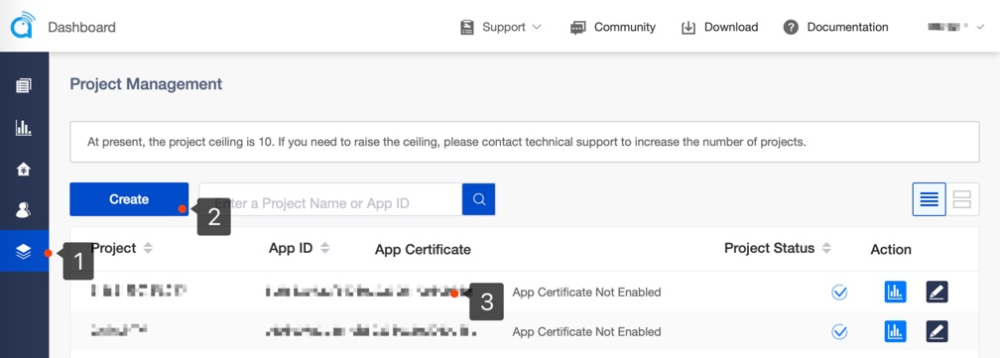
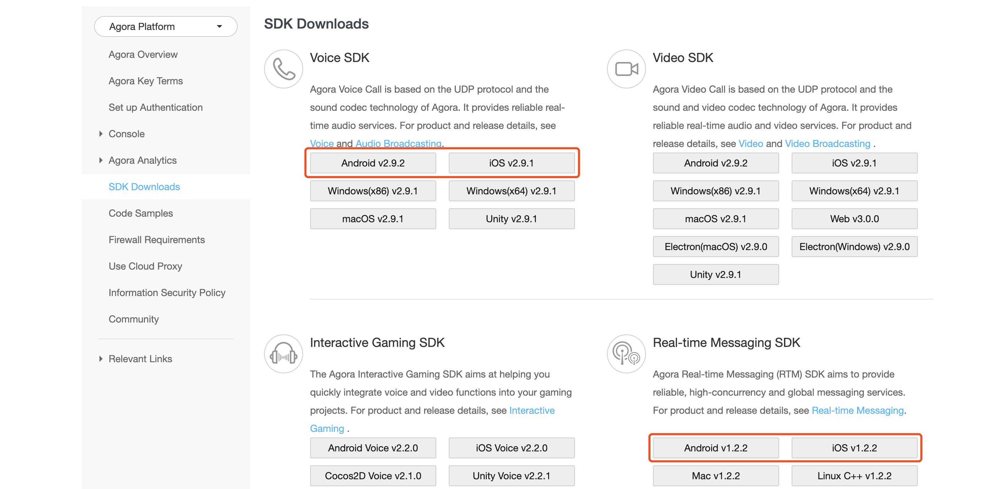

# Chatroom

*Read this in other languages: [简体中文](README.cn.md)*

## Introduction

A typical voice **chatroom** has a host and several audience.

in which:
- The host talks and the audience hear the host.
- The host invites the audience for interaction and the audience switches the user role to be a co-host. 
- The host can mute or unmute the co-host, and delete or add a host position.
- Any change to the host state and host position is immediately known to the host, co-host, and audience in the channel.

This use case particularly applies to scenarios such as  online KTV and FM radio.

Agora supports real-time voice interaction between a maximum of one host + 16 co-hosts. 

## Feature

Use the Agora SDK to implement the following features in your project:

- Real-time voice interaction: Smooth communication between the host and audience guaranteed by ultra-low latency.
- Co-hosting: The audience becomes a co-host and interact with the host, so that all users in the channel can hear the interaction.
- Host position control: The host has the following control privileges: invite an audience to become a co-host, switch a co-host back to an audience, mute and unmute a co-host, delete and resume a host position. Any change to the host state and host position is immediately known to all users in the channel.
- Real-time messaging: The host, co-host, and audience can send IM messages to each other. The audience can also send gifts to the host/co-host.
- User management: Maintains the user list and nicknames of the users in the channel.
- Audio mixing: The host and co-host can play background music while talking.
- Voice changer: Adds special voice effect for the host or co-host to add more fun to the chatroom.

*The sample app shows only the part related to voice chat and is not a complete product. If you want to develop a complete product, you need to implement the rest of the voice chatroom.*

## Run the Sample App

1. Create a developer account at [agora.io](https://sso.agora.io/en/signup) and create a project in Dashboard to get an App ID.


2. Download [Voice SDK and Real-time Messaging SDK](https://docs.agora.io/en/Agora%20Platform/downloads/).


#### Android
1. Add the AppID and Token in the `Android/app/src/main/res/values/strings_config.xml` file.

   ```
   <string name="app_id" translatable="false"><#Your App Id#></string>
   <string name="token" translatable="false"><#Temp Access Token#></string>
   <string name="rtm_token" translatable="false"><#Temp Rtm Access Token#></string>
   ```

2. Unpack the SDKs and do the following:

   - Copy the `libs` folder to the `Android/app` folder.

3. Open the project with Android Studio and connect to an Android test device. Compile and run the sample app.

		Development environment:
		- Android Studio 2.0+.
		- minSdkVersion 16.
		- Emulators may lack the functionality or performance needed to run the sample app. Agora recommends using physical Android devices. 

#### iOS
1. Add the AppID and Token in the `KeyCenter.swift` file.

   ```
   static let AppId: String = <#Your App Id#>
   static let Token: String? = <#Temp Access Token#>
   static let RtmToken: String? = <#Temp Rtm Access Token#>
   ```

2. Unpack the SDKs and copy the `libs` folder to the `iOS/AgoraChatRoom` folder of your project.

3. Open the `iOS/AgoraChatRoom.xcodeproj` file with XCode. Connect to an iOS test device and fill in a valid developer signature.

		Development environment:
		- XCode 10.0+.
		- iOS 8.0+.

## Key API list

||iOS|Android
---|---|---
RTC|[sharedEngineWithAppId:delegate:](https://docs.agora.io/cn/Interactive%20Broadcast/API%20Reference/oc/Classes/AgoraRtcEngineKit.html#//api/name/sharedEngineWithAppId:delegate:)|[create](https://docs.agora.io/cn/Interactive%20Broadcast/API%20Reference/java/classio_1_1agora_1_1rtc_1_1_rtc_engine.html#a35466f690d0a9332f24ea8280021d5ed)
||[setChannelProfile](https://docs.agora.io/cn/Interactive%20Broadcast/API%20Reference/oc/Classes/AgoraRtcEngineKit.html#//api/name/setChannelProfile:)|[setChannelProfile](https://docs.agora.io/cn/Interactive%20Broadcast/API%20Reference/java/classio_1_1agora_1_1rtc_1_1_rtc_engine.html#a1bfb76eb4365b8b97648c3d1b69f2bd6)
||[setClientRole](https://docs.agora.io/cn/Interactive%20Broadcast/API%20Reference/oc/Classes/AgoraRtcEngineKit.html#//api/name/setClientRole:)|[setClientRole](https://docs.agora.io/cn/Interactive%20Broadcast/API%20Reference/java/classio_1_1agora_1_1rtc_1_1_rtc_engine.html#aa2affa28a23d44d18b6889fba03f47ec)
||[setAudioProfile](https://docs.agora.io/cn/Interactive%20Broadcast/API%20Reference/oc/Classes/AgoraRtcEngineKit.html#//api/name/setAudioProfile:scenario:)|[setAudioProfile](https://docs.agora.io/cn/Interactive%20Broadcast/API%20Reference/java/classio_1_1agora_1_1rtc_1_1_rtc_engine.html#a34175b5e04c88d9dc6608b1f38c0275d)
||[joinChannel](https://docs.agora.io/cn/Interactive%20Broadcast/API%20Reference/oc/Classes/AgoraRtcEngineKit.html#//api/name/joinChannelByToken:channelId:info:uid:joinSuccess:)|[joinChannel](https://docs.agora.io/cn/Interactive%20Broadcast/API%20Reference/java/classio_1_1agora_1_1rtc_1_1_rtc_engine.html#a8b308c9102c08cb8dafb4672af1a3b4c)
||[muteLocalAudioStream](https://docs.agora.io/cn/Interactive%20Broadcast/API%20Reference/oc/Classes/AgoraRtcEngineKit.html#//api/name/muteLocalAudioStream:)|[muteLocalAudioStream](https://docs.agora.io/cn/Interactive%20Broadcast/API%20Reference/java/classio_1_1agora_1_1rtc_1_1_rtc_engine.html#a838a04b744e6fb53bd1548d30bff1302)
RTM|[initWithAppId:delegate:](https://docs.agora.io/cn/Real-time-Messaging/API%20Reference/RTM_oc/Classes/AgoraRtmKit.html#//api/name/initWithAppId:delegate:)|[createInstance](https://docs.agora.io/cn/Real-time-Messaging/API%20Reference/RTM_java/classio_1_1agora_1_1rtm_1_1_rtm_client.html#a6411640143c4d0d0cd9481937b754dbf)
||[loginByToken:user:completion:](https://docs.agora.io/cn/Real-time-Messaging/API%20Reference/RTM_oc/Classes/AgoraRtmKit.html#//api/name/loginByToken:user:completion:)|[login](https://docs.agora.io/cn/Real-time-Messaging/API%20Reference/RTM_java/classio_1_1agora_1_1rtm_1_1_rtm_client.html#a995bb1b1bbfc169ee4248bd37e67b24a)
||[createChannelWithId:delegate:](https://docs.agora.io/cn/Real-time-Messaging/API%20Reference/RTM_oc/Classes/AgoraRtmKit.html#//api/name/createChannelWithId:delegate:)|[createChannel](https://docs.agora.io/cn/Real-time-Messaging/API%20Reference/RTM_java/classio_1_1agora_1_1rtm_1_1_rtm_client.html#a95ebbd1a1d902572b444fef7853f335a)
||[joinWithCompletion:](https://docs.agora.io/cn/Real-time-Messaging/API%20Reference/RTM_oc/Classes/AgoraRtmChannel.html#//api/name/joinWithCompletion:)|[join](https://docs.agora.io/cn/Real-time-Messaging/API%20Reference/RTM_java/classio_1_1agora_1_1rtm_1_1_rtm_channel.html#ad7b321869aac2822b3f88f8c01ce0d40)
||[getChannelAttributes:ByKeys:completion:](https://docs.agora.io/cn/Real-time-Messaging/API%20Reference/RTM_oc/Classes/AgoraRtmKit.html#//api/name/getChannelAttributes:ByKeys:completion:)|[getChannelAttributes](https://docs.agora.io/cn/Real-time-Messaging/API%20Reference/RTM_java/classio_1_1agora_1_1rtm_1_1_rtm_client.html#a81f14a747a4012815ab4ba8d9e480fb6)
||[sendMessage:toPeer:completion:](https://docs.agora.io/cn/Real-time-Messaging/API%20Reference/RTM_oc/Classes/AgoraRtmKit.html#//api/name/sendMessage:toPeer:completion:)|[sendMessageToPeer](https://docs.agora.io/cn/Real-time-Messaging/API%20Reference/RTM_java/classio_1_1agora_1_1rtm_1_1_rtm_client.html#a729079805644b3307297fb2e902ab4c9)
||[addOrUpdateLocalUserAttributes:completion:](https://docs.agora.io/cn/Real-time-Messaging/API%20Reference/RTM_oc/Classes/AgoraRtmKit.html#//api/name/addOrUpdateLocalUserAttributes:completion:)|[addOrUpdateChannelAttributes](https://docs.agora.io/cn/Real-time-Messaging/API%20Reference/RTM_java/classio_1_1agora_1_1rtm_1_1_rtm_client.html#a997a31e6bfe1edc9b6ef58a931ef3f23)


## FAQ

1. Q: Noise reduction is disabled when there is only one host and `scenario` in `audioProfile` is set to Default, ShowRoom, Education, and GameStreaming. How can I fix that?

   A: You can enable noise reduction through the private interface: `agoraKit.setParameters("{\"che.audio.enable.ns\":true}")`

2. Q: Calling the `disableAudio` or `leaveChannel`  method stops other apps from using AVAudioSession to play and record. How can I fix that?

   A: You can keep the audio session active by calling the `agoraKit.setAudioSessionOperationRestriction(.deactivateSession)`method after calling the `disableAudio` or `leaveChannel` method.

## Contact Us

- API documentation is available at the [Document Center](https://docs.agora.io/en/).
- For any issue with integration, connect with global developers in the [Developer Community](https://dev.agora.io/en/).
- For genera technical support, submit a ticket at the [Agora Dashboard](https://dashboard.agora.io/).
- For any issue with the sample code, submit an issue at [GitHub](https://github.com/AgoraIO-Usecase/Chatroom/issues).

## License

The MIT License (MIT).