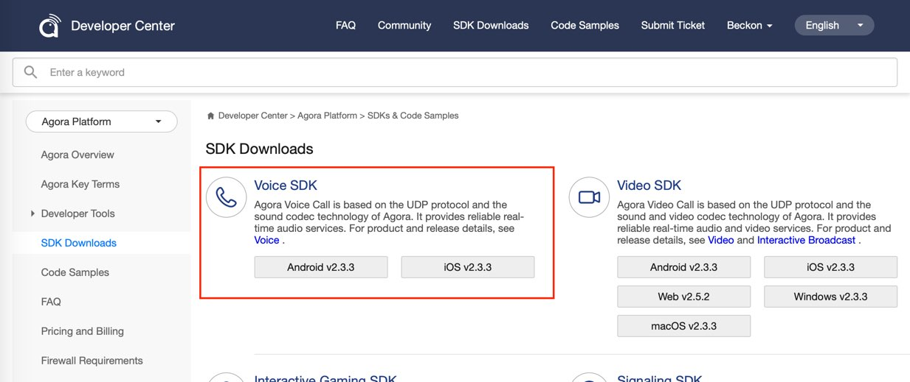

# Chatroom

*Read this in other languages: [简体中文](README.cn.md)*

## Introduction

**Chatroom** is an audio-only scenario. Users can join the room as a host or an audience for voice chat and also switch roles.

This sample app demonstrates the following types of voice chatrooms:

- **Gaming**: Gaming chatroom where users switch roles frequently and care about data usage.
- **Entertainment**: Entertainment chatroom where users switch roles frequently and care about high-audio quality but not data usage.
- **Online KTV**: Karaoke television chatroom where users sing along with the music.
- **FM**: FM radio broadcasting chatroom where users care about high-fidelity audio quality. 

## Feature

This sample app shows how to use the Agora Native SDK for Voice to enable users to chat in different types of voice chatrooms with the following features:

- Join a room: Choose a room type, join the room as a host or an audience, and communicate with other users in the room.
- Switch roles: Use the “Host/Audience” button to switch roles.
- Switch between an earpiece and a speakerphone: Use the "Earpiece/Speakerphone" button to change the playback route.
- Stop sending the voice: Use the "Mute Yourself" button to stop sending voice.
- Stop receiving the voice: Use the "No Voice" button to stop receiving voice from other users in the room.
- Play the music: Use the "Music" button to play music and send it to other users in the room. 
- Change the voice: Use the "Voice Change" button to select different voice effects.

*The sample app shows only the part related to voice chat and is not a complete product. If you want to develop a complete product, you need to implement the rest of the voice chatroom.*

## Run the Sample App

1. Create a developer account at [agora.io](https://sso.agora.io/en/signup) and create a project in Dashboard to get an App ID.


2. Download [the Agora Native SDK for Voice](https://docs.agora.io/en/Agora%20Platform/downloads/).


#### Android
1. Add the App ID in the `Android/app/src/main/res/values/strings_config.xml` file.

   ```
   <string name="private_app_id"><#YOUR APP ID#></string>
   ```

2. Unpack the SDK and do the following:

   - Copy the `*.jar`  file under the `libs` folder to the `app/libs` folder. 
   - Copy the  `arm64-v8a/x86/armeabi-v7a`  file under `libs` folder to the `app/src/main/jniLib` folder.

3. Open the project with Android Studio and connect to an Android test device. Compile and run the sample app.

		Development environment:
		- Android Studio 2.0+.
		- minSdkVersion 16.
		- Emulators may lack the functionality or performance needed to run the sample app. Agora recommends using physical Android devices. 

#### iOS
1. Add the App ID in the `KeyCenter.swift` file.

   ```
   static func appId() -> String {
       return <#YOUR APPID#>
   }
   ```

2. Unpack the SDK and copy the `AgoraAudioKit.framework` file to the `iOS/ChatRoom` folder of your project.

3. Open the `iOS/AgoraChatRoom.xcodeproj` file with XCode. Connect to an iOS test device and fill in a valid developer signature.

		Development environment:
		- XCode 10.0+.
		- iOS 8.0+.

## Key API list

iOS|Android
---|---
[sharedEngineWithAppId:delegate:](https://docs.agora.io/en/Interactive%20Broadcast/API%20Reference/oc/Classes/AgoraRtcEngineKit.html#//api/name/sharedEngineWithAppId:delegate:)|[create](https://docs.agora.io/en/Interactive%20Broadcast/API%20Reference/java/classio_1_1agora_1_1rtc_1_1_rtc_engine.html#a35466f690d0a9332f24ea8280021d5ed)
[setChannelProfile](https://docs.agora.io/en/Interactive%20Broadcast/API%20Reference/oc/Classes/AgoraRtcEngineKit.html#//api/name/setChannelProfile:)|[setChannelProfile](https://docs.agora.io/en/Interactive%20Broadcast/API%20Reference/java/classio_1_1agora_1_1rtc_1_1_rtc_engine.html#a1bfb76eb4365b8b97648c3d1b69f2bd6)
[setClientRole](https://docs.agora.io/en/Interactive%20Broadcast/API%20Reference/oc/Classes/AgoraRtcEngineKit.html#//api/name/setClientRole:)|[setClientRole](https://docs.agora.io/en/Interactive%20Broadcast/API%20Reference/java/classio_1_1agora_1_1rtc_1_1_rtc_engine.html#aa2affa28a23d44d18b6889fba03f47ec)
[setAudioProfile](https://docs.agora.io/en/Interactive%20Broadcast/API%20Reference/oc/Classes/AgoraRtcEngineKit.html#//api/name/setAudioProfile:scenario:)|[setAudioProfile](https://docs.agora.io/en/Interactive%20Broadcast/API%20Reference/java/classio_1_1agora_1_1rtc_1_1_rtc_engine.html#a34175b5e04c88d9dc6608b1f38c0275d)
[joinChannel](https://docs.agora.io/en/Interactive%20Broadcast/API%20Reference/oc/Classes/AgoraRtcEngineKit.html#//api/name/joinChannelByToken:channelId:info:uid:joinSuccess:)|[joinChannel](https://docs.agora.io/en/Interactive%20Broadcast/API%20Reference/java/classio_1_1agora_1_1rtc_1_1_rtc_engine.html#a8b308c9102c08cb8dafb4672af1a3b4c)


## FAQ

1. Q: Noise reduction is disabled when there is only one host and `scenario` in `audioProfile` is set to Default, ShowRoom, Education, and GameStreaming. How can I fix that?

   A: You can enable noise reduction through the private interface: `agoraKit.setParameters("{\"che.audio.enable.ns\":true}")`

2. Q: Calling the `disableAudio` or `leaveChannel`  method stops other apps from using AVAudioSession to play and record. How can I fix that?

   A: You can keep the audio session active by calling the `agoraKit.setAudioSessionOperationRestriction(.deactivateSession)`method after calling the `disableAudio` or `leaveChannel` method.

## Contact Us

- API documentation is available at the [Document Center](https://docs.agora.io/en/).
- For any issue with integration, connect with global developers in the [Developer Community](https://dev.agora.io/en/).
- For genera technical support, submit a ticket at the [Agora Dashboard](https://dashboard.agora.io/).
- For any issue with the sample code, submit an issue at [GitHub](https://github.com/AgoraIO-Usecase/Chatroom/issues).

## License

The MIT License (MIT).